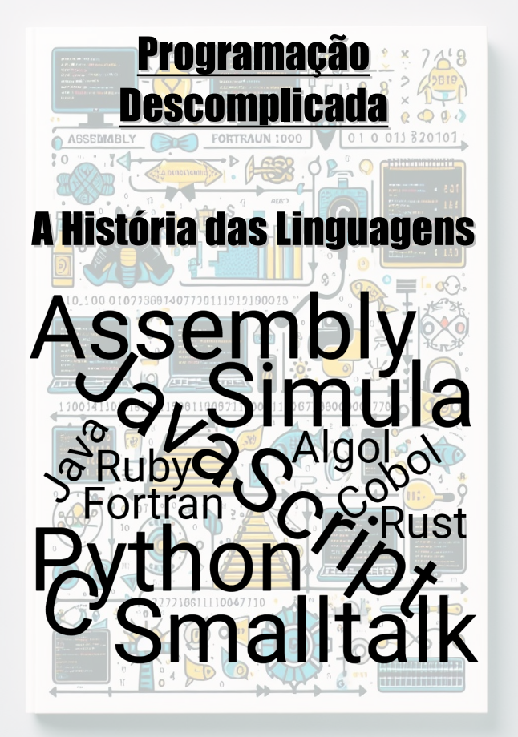

---

# Projeto de Ebook criado com assistência de Inteligências Artificiais

Este é um projeto criado para uma aula do Santander Bootcamp 2024 - Fundamentos de IA Para Devs, o objetivo é criar um ebook utilizando IAs, para gerar imagens e ideias de texto.

<a href="./assets/Ebook - Evolução das Linguagens de Programação.pdf" title="Abrir PDF">📕 Leitura</a>

## Tecnologias utilizadas nesse projeto

## 🧠 Prompts

ChatGPT:
|Ação|Prompt|
|----|------|
|Act prompt|Estou escrevendo um ebook de poucas páginas no qual quero abordar a evolução das linguagens de programação, dando foco em passagens importantes e linguagens que marcaram a história, trazendo grandes avanços. Quero que você assuma o lugar de roteirista desse ebook para contribuir com algumas ideias, assumindo um tom de voz informal, acessível à todos os públicos em formato dinâmico|
|Título|Me forneça 5 ideias de título para esse livro|
|Conteúdo|Escreva os textos para cada capítulo em um tom como se estivesse explicando para uma criança de 10 anos e fazendo analogias e referências que facilitem o entendimento.|

Bing Copilot Designer

|Ação|Prompt|
|----|------|
|Capa|Create an image for the cover of an eBook about the evolution of programming languages. The cover should show a visual timeline representing the progress of programming languages over the years, starting with Assembly and Fortran code and moving on to modern languages like Python and JavaScript. Include icons or symbols representing each language, such as 0s and 1s for Assembly, mathematical equations for Fortran, and modern language symbols for Python and JavaScript.|

## ✨ Features

- Conteúdo construído com assistência do ChatGPT
- Imagem da capa e do conteúdo do livro geradas via Bing Copilot Designer
- Exemplos de código gerados via Carbon

---

Projeto desenvolvido por [Héber Stavrakas Gaipo](https://github.com/Heber-Stavrakas-Gaipo) inspirado em um projeto Digital Innovation One, por [Felipe Aguiar](https://github.com/felipeAguiarCode).